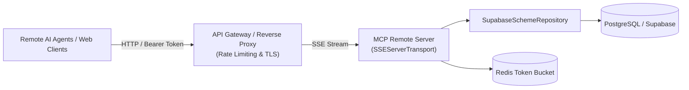

# India Schemes MCP Server — System Design & Architecture

> **Purpose of this document**: Plain-English engineering rationale explaining key design decisions behind `india-schemes-mcp`. This document serves as both architectural documentation and interview preparation for senior systems/API design discussions.

---

## 1. Context & Business Problem

**Yojana Dost** was originally built as a web platform providing citizen access to 150+ Indian central and state government welfare schemes. While web apps serve direct human traffic, modern AI assistants (Claude, Cursor, custom enterprise agents) require **structured, tool-mediated access** to ground their reasoning in factual, up-to-date policy data.

Rather than building a brittle web scraper or tutorial-style demo server, `india-schemes-mcp` is designed as a **production infrastructure layer** that exposes the scheme domain as native Model Context Protocol (MCP) primitives.

---

## 2. Transport Architecture: `stdio` vs. Remote (`SSE` / `HTTP`)

### Why `stdio` for Local MCP Clients
- **Zero Network Overhead & Latency**: `stdio` communicates directly over operating system pipes between the parent process (Claude Desktop / Cursor) and the spawned Node.js child process.
- **Strict Security Isolation**: The server runs locally in the user's secure environment without exposing open network ports, TLS certificates, or authentication handshakes.
- **Ephemeral Lifecycle**: The client process manages the server's lifecycle automatically, starting it on launch and terminating it on exit.

### The `stdout` Contamination Pitfall
In the MCP `stdio` specification:
- `stdout` is **strictly reserved** for JSON-RPC 2.0 frames (`Content-Length: ...` or newline-delimited JSON).
- If any internal module or third-party dependency executes `console.log()` or writes arbitrary text to `stdout`, the client's JSON-RPC stream parser immediately breaks with a fatal framing error.
- **Design Decision**: We enforce a strict logging boundary via `src/lib/logger.ts`. All application diagnostics, performance metrics, and errors stream exclusively to `stderr`, which MCP clients capture as debug logs without corrupting the message stream.

---

## 3. Data-Driven Eligibility Rules Engine

### Why Hardcoded `if/else` Fails at Scale
Traditional welfare applications often write dedicated procedural handlers for each scheme:
```ts
// Anti-pattern: Hardcoded per-scheme logic
if (schemeId === "atal-pension") {
  if (profile.age >= 18 && profile.age <= 40) return true;
}
```
This breaks down immediately when scaling to 150+ central schemes, 30+ states, and frequent government policy updates. Modifying eligibility criteria would require modifying TypeScript application code, recompiling, and redeploying.

### Declarative AST Rule Structure
In `india-schemes-mcp`, every scheme defines its eligibility criteria as an array of declarative rule objects stored alongside the scheme record:

```json
{
  "field": "age",
  "operator": "gte",
  "value": 18,
  "description": "Applicant must be at least 18 years old"
}
```

The engine (`src/lib/eligibility.ts`) evaluates any arbitrary set of rules against the applicant's profile:
1. **Supported Comparison Operators**:
   - Scalar comparisons: `gte`, `lte`, `gt`, `lt`, `eq`, `neq`
   - Set-based memberships: `in`, `not_in` (with case-insensitive normalization and `"All India"` bypass logic).
2. **Partial Profile & Diagnostic Transparency**:
   - If a citizen does not provide their annual income, the engine does not falsely fail the check. Instead, it classifies the rule under `unevaluated_rules` while evaluating all other conditions.
   - The response details exactly which rules passed, which failed with human-readable rationale, and which required fields are missing.

---

## 4. Repository Pattern & Backend Decoupling

### Problem
Development and offline testing require an instant, zero-dependency JSON store (`src/data/schemes.json`). However, production Yojana Dost runs on PostgreSQL / Supabase with 150+ dynamically updated records.

### Solution: `ISchemeRepository`
We implement a strict Repository Pattern (`src/lib/repository.ts`):

```ts
export interface ISchemeRepository {
  getAll(): Promise<Scheme[]>;
  getById(id: string): Promise<Scheme | null>;
  getByIds(ids: string[]): Promise<Scheme[]>;
  search(query: string, options?: SearchOptions): Promise<ScoredScheme[]>;
}
```

- **Swapping Backends**: To migrate from JSON to Supabase, we simply create `SupabaseSchemeRepository implements ISchemeRepository` (e.g. querying `@supabase/supabase-js`) and invoke `setSchemeRepository(new SupabaseSchemeRepository(client))`.
- **Zero Tool Mutation**: None of the 6 tool implementations (`search_schemes`, `get_scheme`, etc.) touch the database or file system directly; they interact strictly with the repository interface.

### Search Relevance Algorithm
The search engine performs multi-weighted keyword scoring without relying on heavy external search clusters:
- Exact ID match: `+100` points
- Exact Name match: `+80` points
- Full query substring in title: `+40` points
- Token match in scheme title: `+25` points
- Token match in category / ministry: `+15` points
- Token match in description / benefits: `+10` points
- Token match in state / keywords: `+5` points

---

## 5. Rate Limiting Strategy: In-Memory Token Bucket

### Why Token Bucket?
- **Burst Tolerance**: Unlike a Fixed Window algorithm (which resets counters abruptly and allows double-bursts at window boundaries), a Token Bucket allows burst requests up to `capacity` (e.g. 30 tokens) while enforcing a smooth, continuous replenishment rate (e.g. 0.5 tokens/sec = 30 tokens/min).
- **Low Memory Footprint**: Tracks only two scalar values per client: `tokens: number` and `lastRefillTimestamp: number`.
- **Automatic Garbage Collection**: An unreferenced interval cleans up idle client buckets older than 10 minutes to prevent memory leaks in multi-client sessions.

---

## 6. Resilience, Error Boundaries & Protocol Guarantees

### Central Error Isolation Wrapper (`createSafeToolHandler`)
- In MCP, if a tool handler throws an unhandled rejection, the server process could crash or hang the client socket.
- `createSafeToolHandler` wraps every tool execution in a `try/catch` boundary:
  - Consumes rate limit tokens.
  - Measures execution latency via `performance.now()`.
  - Emits structured STDERR telemetry logs.
  - On error (e.g. `SchemeNotFoundError`, `RateLimitExceededError`, `ValidationError`), formats a clean JSON payload `{ error: { code, message, details } }` with `isError: true` without crashing the server.

### Structured JSON Responses vs. Markdown
- Returning Markdown strings from tools is a common anti-pattern that impairs downstream LLM reasoning and breaks programmatic tool chaining.
- All tools in `india-schemes-mcp` return strictly validated, serialized JSON objects that LLMs can parse deterministically to extract fields, aggregate data, or chain into subsequent tool calls.

---

## 7. Migration Blueprint: Moving from `stdio` to Remote (`SSE` / `HTTP`)

When deploying `india-schemes-mcp` as a remote cloud service for web clients or multi-tenant agent platforms:



### Key Changes Required:
1. **Transport Layer**: Replace `StdioServerTransport` with `SSEServerTransport` (or HTTP Streamable endpoints) using Express / Fastify / Hono.
2. **Authentication & Authorization**: Add API Key or JWT validation at the HTTP middleware layer before dispatching to tool handlers.
3. **Distributed Rate Limiting**: Swap the in-memory `TokenBucketRateLimiter` for a distributed Redis-backed rate limiter (`ioredis` with Lua script) to coordinate limits across horizontal server replicas.
4. **Data Repository**: Switch `JsonSchemeRepository` to `SupabaseSchemeRepository` connected to the live PostgreSQL database with connection pooling (`pgbouncer`).
